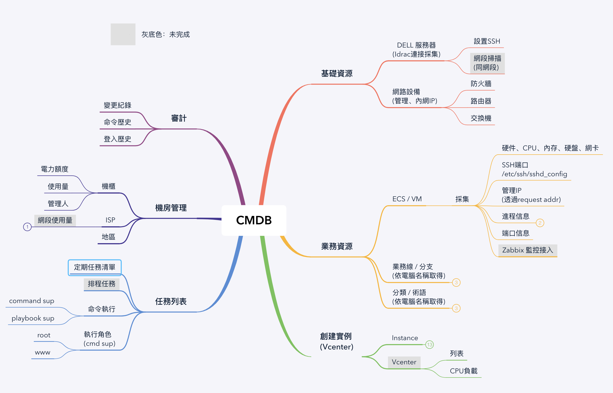
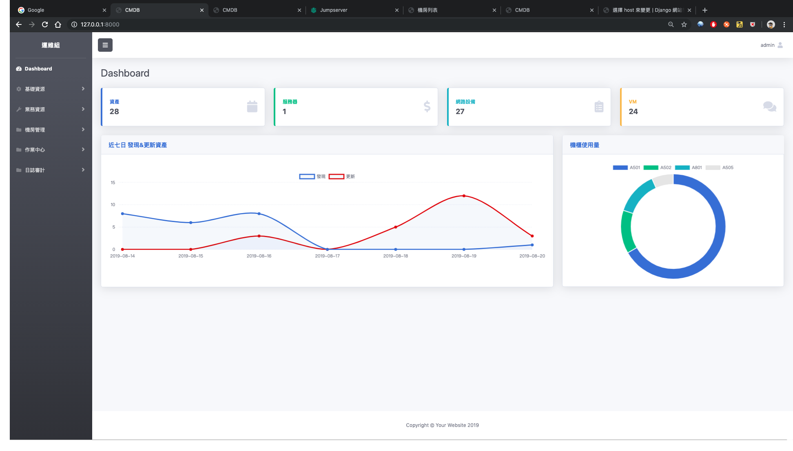

CMDB
===

自動iDRAC獲取服務器信息、採集資產信息、批量命令執行、機房管理。

# 开发语言与框架

- 编程语言：Python3.6
- 前端Web框架：Bootstrap
- 后端Web框架：Django
- 后端Task框架：Celery + Redis

# 功能目標

# Web地址

https://autocmdb-jrptmn2eua-uc.a.run.app

admin / admin 

